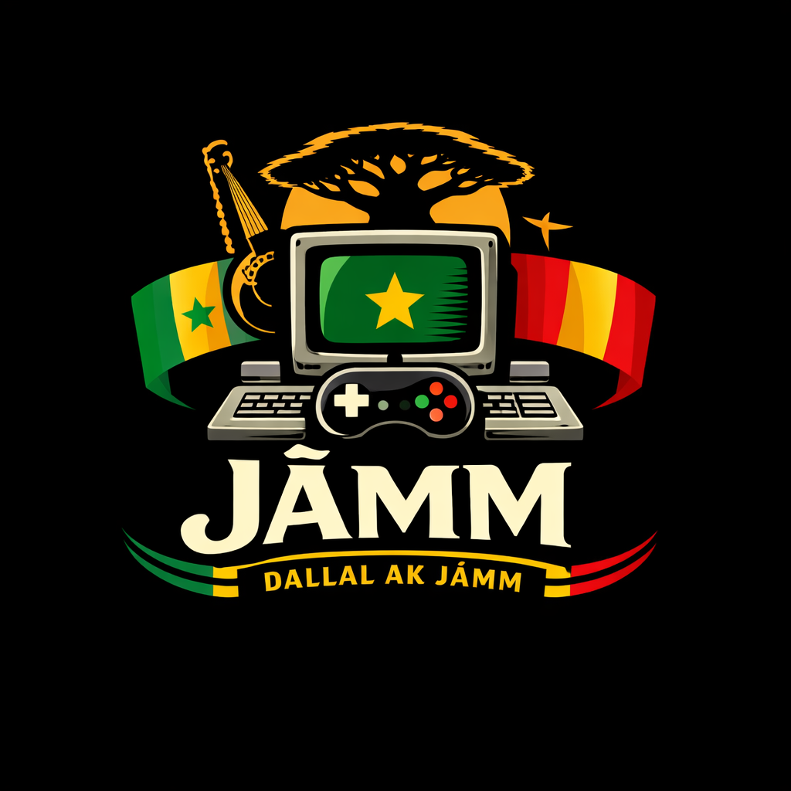
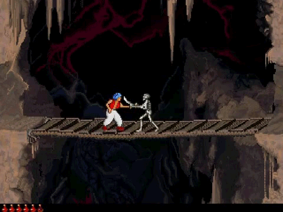
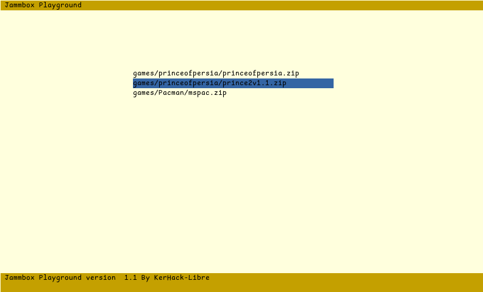
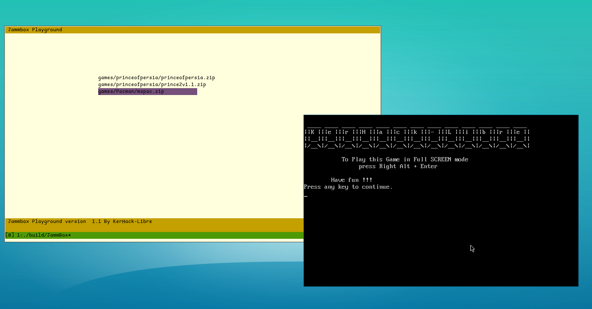
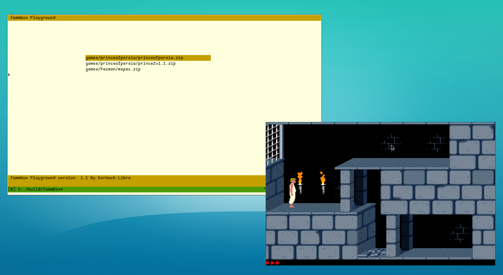
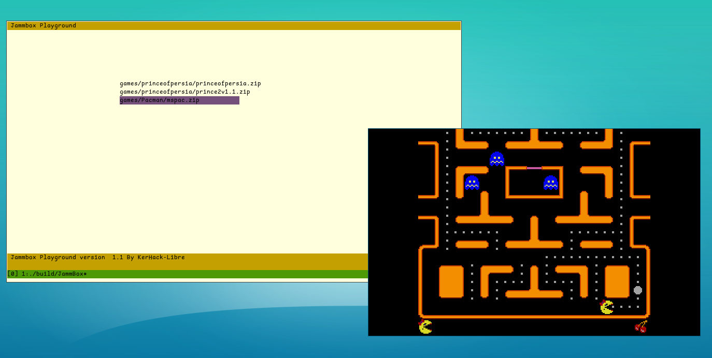

<br>



Parce _**jàmm**_, c’est avant tout : **Paix**, **détente** & **fun**.
Ceci est  une petite invitation à souffler en replongeant dans des jeux simples, directs, addictifs… comme avant.

JàmmBox célèbre le plaisir brut du rétro‑gaming : pas de surcharge, pas de configuration compliquée  juste lancer un jeu et s’amuser.
Un esprit _**local, rétro, et accessible à tous...**_

**Dallal Ak Jàmm**
Ce dépôt est conçu pour (re)découvrir le charme intemporel des jeux DOS classiques, déjà préconfigurés pour fonctionner directement avec DOSBox.

</br>

Que tu sois :

- nostalgique de l’ère MS‑DOS 🖥️ 
- curieux de l’histoire du jeu vidéo 🎞️
- ou simplement à la recherche d’un moment de détente


### 🎯 Objectif du projet

- Proposer une collection de jeux DOS prêts à l’emploi
- Préserver et partager l’esprit des jeux « à l’ancienne »
- Offrir une expérience simple qui peut aussi inspirer les curieux à découvrir l’informatique
- Un moment de détente et de fun, pour tous les âges

Une seule condition pour jouer confortablement : avoir DOSBox installé. C’est tout

### Contenu du depot 
```bash 
/games/ : les jeux DOS configurés
/src/   : Programme  code source en C
/assets/: Les assets 
 |- misc   : divers
 |- images : Images des jeux  
 |- logos  : Logos
 |- screenshoot: 
README.md : tu es ici 👋
```

### 🚀 Installation & utilisation
1️⃣ Cloner le dépôt
La méthode la plus simple est de cloner le dépôt afin de pouvoir le mettre à jour facilement avec git pull.

```bash 
git clone <url_du_repo>
cd Jammbox
```
2️⃣ Dépendances requises

Avant de compiler, assure‑toi d’avoir :

* DOSBox
* libzip (gestion des archives de jeux)
* ncurses (interface du menu)

3️⃣ Compilation
```bash 
meson setup build 
meson compile -C build 
```
4️⃣ Lancer JàmmBox

```bash
./build/Jammbox 
```
✨ Et laisse la magie de DOSBox opérer.

##### 🕹️ Jeux disponibles 

| Jeux |  gameplay |
|------|-----------|
|✅ Prince of Persia (1990)|
|✅ Prince of Persia 2 — The Shadow and the Flame|
|✅ Ms. Pac‑Man: Maze Madness|

🔧 Le projet est en amélioration continue. D’autres jeux arriveront bientôt : action, plateforme, puzzle, aventure, etc.

### 🖼️ Aperçu du launcher JàmmBox 


|||
|-|-|
|ui menu||
|Booting||
|prince of persia | |
|pacman | 

### 🧩 Contributions

Les contributions sont les bienvenues 🙌
Tu peux proposer :

- 💡 une idée
- 🎮 un jeu à ajouter
- 🐛 un bug / correctif
- 🛠️ une amélioration
- 💬 une discussion  

N’hésite pas à ouvrir une issue ou une pull request. Je reste à l’écoute.

### TODO-List 

- [ ] - Faire Porter Directement Libzip et le ncurses  dans le code source. 
- [ ] - Ajouter une restriction  pour supporter seulement le systeme de fichier FAT 16 & 32 
- [ ] - Amelioration continue du User Interface
- [ ] - Amelioration de l'archive  pour qu'il contienne en plus de l'image du jeux ansi que le plan de description 
- [ ] - Faire Porter sur FreeDOS (a definir)
- [ ] - Mise en place d'un Conteneur pour faciliter l'usage dans un Sandbox (pour les frileux...)
- [ ] - Diversifier le build (faire un makefile simple pour certains qui n'ont pas le systeme de build meson) 

### Auteur & Mainteneur
Umar Ba [jUmarB@protonmail.com](jUmarB@protonmail.com) 
_KerHack-Libre_ : “**comprendre**, **construire**, **transmettre**.”
</br>
### ⚖️ Licence


_L’ensemble des projets de KërHack-Libre sont distribués sous GPLv3,
en accord avec les **4 libertés fondamentales du logiciel libre**_ 

 <a href="https://github.com/KerHack-Libre/https://github.com/KerHack-Libre/JammBox/" align="left"></a>

