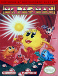
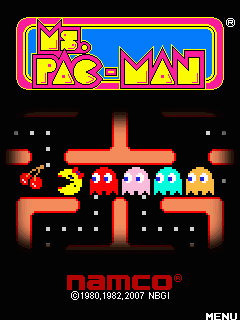

**🟡 Ms. Pac-Man Maze Madness (1996)**
*Ms. Pac-Man Maze Madness* est un jeu d’arcade en 3D sorti en 1996, marquant une évolution majeure de la franchise *Pac-Man*. Le jeu propose des labyrinthes tridimensionnels, combinant action, exploration et résolution d’énigmes.

---

## 📖 Résumé

Dans *Ms. Pac-Man Maze Madness*, le joueur incarne **Ms. Pac-Man** à travers plusieurs mondes thématiques composés de labyrinthes en 3D. L’objectif principal reste fidèle à l’esprit de la série : collecter toutes les pastilles tout en évitant les fantômes.

Le jeu introduit de nouvelles mécaniques, comme des **puzzles environnementaux**, des **objets interactifs** et des **power-ups**, offrant une expérience plus stratégique tout en conservant le rythme arcade emblématique de *Pac-Man*.

## 🎮 Contrôles

### ⌨️ Clavier / 🎮 Manette (par défaut)

| Touche / Bouton | Action |
|---------------|-------|
| Flèches directionnelles / Stick analogique | Déplacer Ms. Pac-Man |
| Bouton Action / A / X | Utiliser un objet / activer un mécanisme |
| Bouton Attaque | Lancer un power-up |
| Bouton Caméra | Ajuster la caméra |
| Start | Pause |
| Select | Menu / Options |

## 🕹️ Gameplay

- Labyrinthes en **3D temps réel**
- Fantômes avec comportements variés
- Power-ups classiques et nouveaux objets
- Niveaux à énigmes et défis chronométrés

## 📌 Notes

- Sortie originale : **1996**
- Genre : Arcade / Action / Puzzle
- Plateformes : PlayStation, Nintendo 64, PC (DOS)
- Première adaptation 3D majeure de Ms. Pac-Man

## ❤️ Héritage

*Ms. Pac-Man Maze Madness* représente une tentative ambitieuse de modernisation de la série *Pac-Man*, tout en respectant les mécaniques fondamentales qui ont fait son succès depuis l’arcade.

