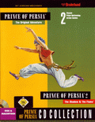

# 🏰 Prince of Persia: The Shadow and the Flame

Suite directe du jeu culte *Prince of Persia*, **The Shadow and the Flame** propose une aventure plus sombre, plus profonde et plus exigeante, mêlant plateformes, combats à l’épée et narration.

---

## 📖 Résumé de l’histoire

Après avoir vaincu Jaffar et sauvé la Princesse, le Prince est injustement banni du royaume. Désormais exilé, traqué et sans patrie, il entame un long voyage à travers des terres hostiles à la recherche de ses origines.

Son périple le conduit jusqu’à son lieu de naissance, où il découvre sa véritable identité : celle du prince légitime. Mais cette quête n’est pas seulement extérieure. Le Prince doit aussi affronter le **Shadow Man**, une incarnation sombre de lui-même, symbole de son conflit intérieur.

Le jeu explore les thèmes de l’identité, du destin et de la dualité, tout en conservant un gameplay exigeant basé sur la précision et le timing.

---

## 🎮 Contrôles

### ⌨️ Commandes clavier

| Touches | Action |
|-------|-------|
| ← ou 4 ou S ou J | Courir vers la gauche |
| → ou 6 ou F ou L | Courir vers la droite |
| ↑ ou 8 ou E ou I | Sauter / grimper / bloquer un coup d’épée |
| ↓ ou 2 ou D ou K | Descendre / s’accroupir / rengainer l’épée |
| ← + ↑ ou 7 ou W ou U | Sauter vers la gauche |
| ↑ + → ou 9 ou R ou O | Sauter vers la droite |
| Shift | Ramasser un objet / s’accrocher à un rebord |
| Shift + ← ou → | Marcher prudemment / se tourner (combat à l’épée) |
| Ctrl ou 0 | Dégainer l’épée / attaquer / lancer une boule de feu (Shadow Man) |
| ← → (rapidement) | Devenir le Shadow Man (niveau 15) |
| Barre d’espace | Afficher le temps restant (après le niveau 3) |
| Échap (Esc) | Pause du jeu |
| Alt + S | Activer / désactiver le son |
| Alt + M | Activer / désactiver la musique |
| Alt + R | Redémarrer le jeu (écran titre) |
| Alt + A | Recommencer le niveau en cours |
| Alt + O | Menu Options |
| Alt + H | Hall of Fame |
| Alt + Q | Quitter le jeu (retour DOS) |

---

## 🕹️ Conseils de jeu

- Le gameplay repose fortement sur l’inertie et le timing.
- Les combats à l’épée nécessitent patience et placement.
- Le Shadow Man introduit des mécaniques uniques plus tard dans le jeu.

---

## 📌 Notes

- Jeu initialement conçu pour DOS
- Clavier fortement sollicité
- Difficulté progressive mais exigeante

---

## ❤️ Héritage

*Prince of Persia: The Shadow and the Flame* est souvent considéré comme l’un des meilleurs épisodes de la saga classique, tant pour son gameplay que pour sa narration plus mature.

---

